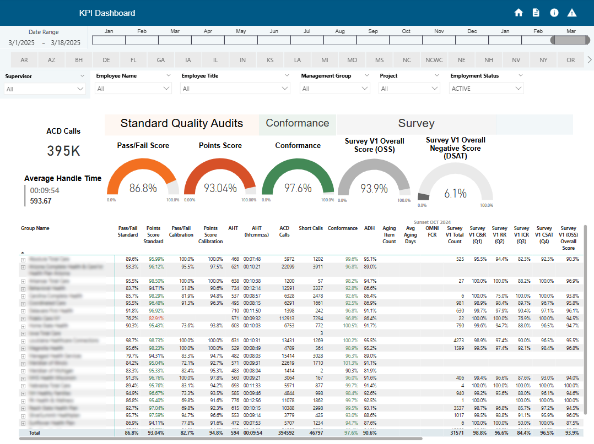
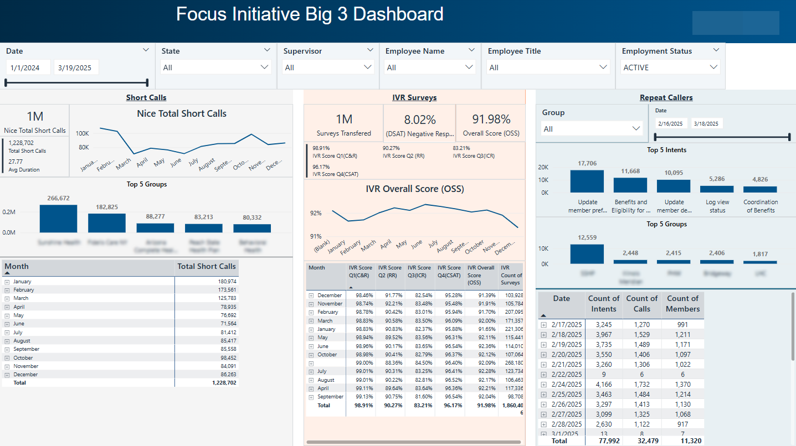
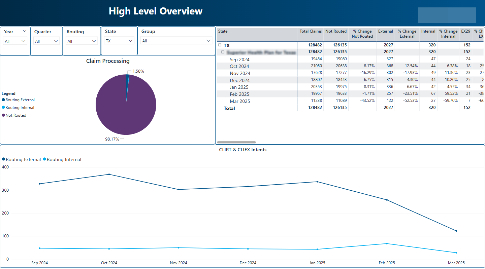
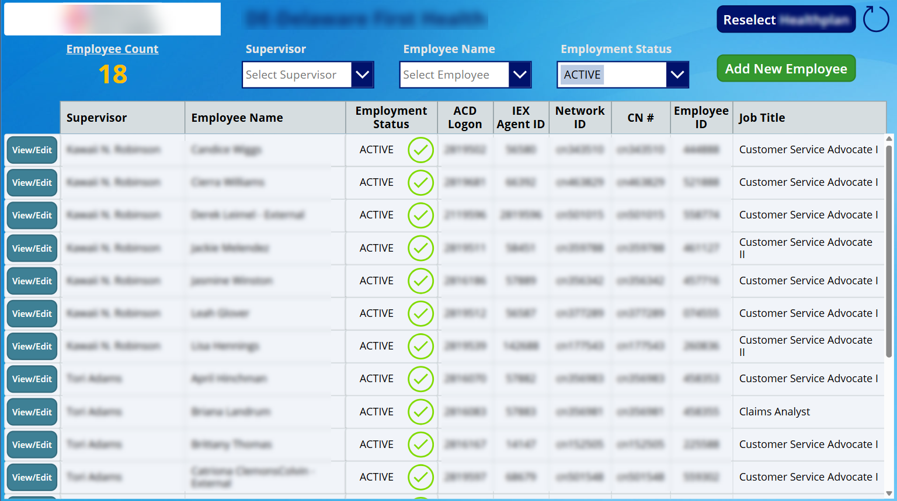

# Project 1: KPI Dashboard

This is a project that was created to provide metric results for each group and the group members from multiple datasets.

* Data was taken from Teradata database, Snowflake database, SharePoint, and source systems.
* The dashboard was structured for an overview of their metrics.
* If more in-depth views of each metric were needed, there were specific metric pages that provided that information.
* Each page provided slicers for the end user to filter the data to their specific needs.

## KPI Dashboard 

# Project 2: Focus Initiative

This project provided key details for 3 areas of concern. The goal was to provide details in each area to find causes and resolutions for improvement.

* Data was taken from Teradata database.
* The dashboard gave an overall overview of each area of concern.
* There were pages for each area that provided greater details for research purposes.

## Focus Initiative Dashboard 

# Project 3: High Level Overview

This project provided key details for the routing of claims. This was needed to assist improving claim work processes.

* Data was taken from Teradata database.
* The High Level Overview gives summary information for each State and their claim routing.
* There were pages that provided more in-depth information for the claims.

## High Level Overview 

# Project 4: Power App

This is an example of a Power App I created to assist in managing the group employee roster needed for the reports I provided.

* Data was stored in SharePoint.
* Options in the app to Add New Employee or View/Edit existing employee profiles.

## Power App Roster 
